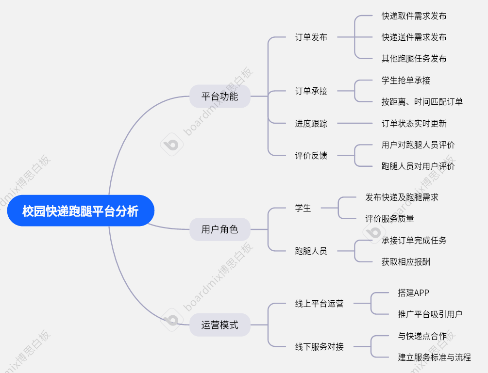

# 软件工程定项第一次会议记录

 * **参会者**：张屹晨，李东儒，邱瑞杰，李朝旭
 * **时间**：2025年9月16号周二 南一楼

## 项目选择
校园快递跑腿平台

## 项目分析（头脑风暴）
* 校园快递数量多，部分学生不方便取件（距离远、时间不合适）。

* 跑腿人员（骑手/学生）可以接单代取，赚取一定费用。

* 平台需要保障交易安全与评价体系。

* 需要考虑实时性（订单状态）、可靠性（超时提醒）、以及用户体验（简单下单）。

### 题目来源
* 现实校园快递取件需求

* 部分外卖平台已有类似功能，但覆盖不到校内

* 结合软件工程课程要求：选题应贴近实际、可实现、有推广性

### 需求
**功能需求**：

* 用户注册/登录（学生端、跑腿端）

* 发布订单（填写取件码、快递点、宿舍地址、酬金）

* 跑腿端接单/取消订单

* 订单状态管理（已发布 → 已接单 → 已完成）

* 评价系统（用户对跑腿员评价，反之亦然）

* 消息通知（短信/微信小程序提醒）

**非功能需求**：

* 安全性：保证用户数据与支付安全

* 易用性：界面简洁，操作流程 3 步内完成

* 可扩展性：未来可接入支付宝/微信支付，扩展跑腿范围

## 思维导图

## 会议图片

