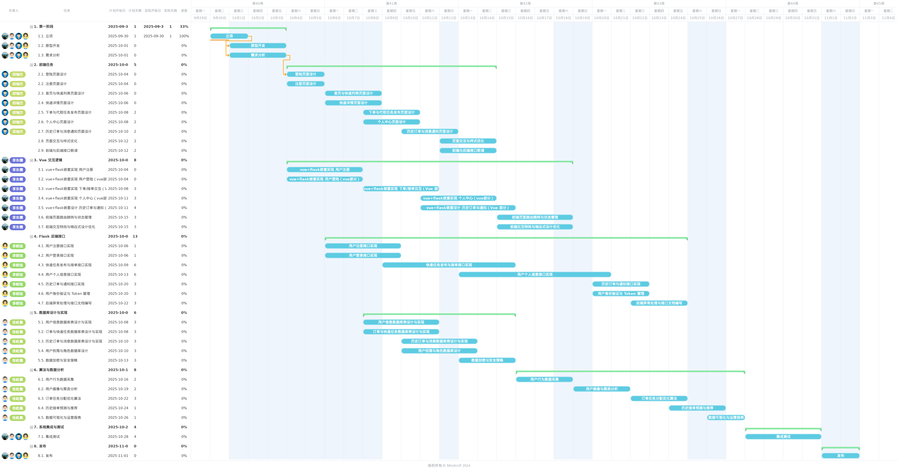

## 任务分解
任务安排:
前端任务（邱瑞杰）
1. 登陆页面设计
2. 注册页面设计
3. 首页与快递列表页面设计
4. 快递详情页面设计
5. 下单与代取任务发布页面设计
6. 个人中心页面设计
7. 历史订单与消息通知页面设计
8. 页面交互与样式优化
9. 前端与后端接口联调
----

Vue 交互逻辑（李东儒）
1. vue+flask嵌套实现 用户注册（vue部分）
2. vue+flask嵌套实现 用户登陆（vue部分）
3. vue+flask嵌套实现 下单/接单交互（Vue 部分）
4. vue+flask嵌套实现 个人中心（vue部分）
5. vue+flask嵌套设计 历史订单与通知（Vue 部分）
6. 前端页面路由跳转与状态管理
7. 前端交互特效与响应式设计优化
----

Flask 后端接口（李朝旭）
1. Flask 用户注册接口实现
2. Flask 用户登录接口实现
3. Flask 快递任务发布与接单接口实现
4. Flask 用户个人信息接口实现
5. Flask 历史订单与通知接口实现
6. 用户身份验证与 Token 管理
7. 后端异常处理与接口文档编写
----

数据库设计与实现（张屹晨）
1. 用户信息数据库表设计与实现
2. 订单与快递任务数据库表设计与实现
3. 历史订单与消息数据库表设计与实现
4. 用户权限与角色数据库设计
5. 数据加密与安全策略
----

算法与数据分析（张屹晨）
1. 用户行为数据采集
2. 用户画像与聚类分析
3. 订单任务分配优化算法
4. 历史接单预测与推荐
5. 数据可视化与运营报表
----

系统集成与测试（全体成员）
1. 前后端接口联调与集成测试
2. 平台测试与兼容性调试
3. 服务器部署与运维
4. 域名解析与 HTTPS 证书配置
5. 内网穿透/端口管理
6. 压力测试与安全测试
----

发布：（邱瑞杰，李东儒，李朝旭，张屹晨）

## 进度安排
在线链接：https://gantt.mindsup.cn/share/uaK5TCmXE
