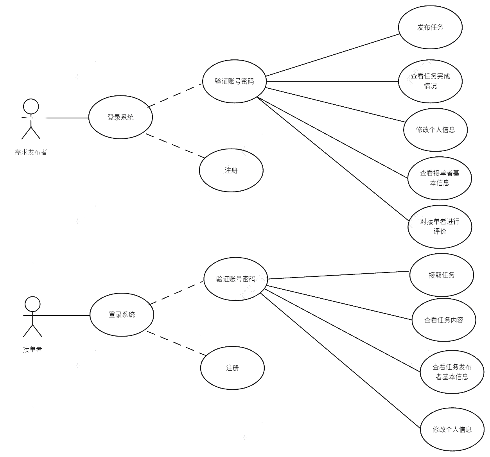
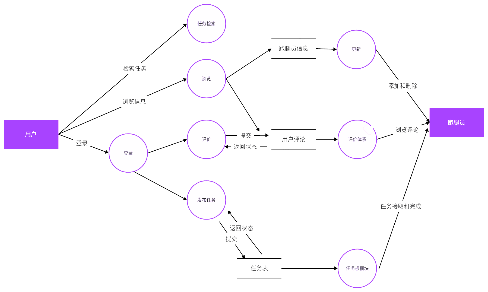
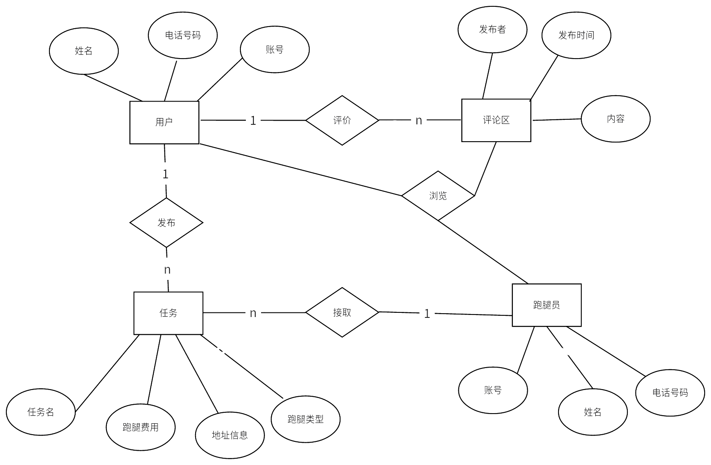
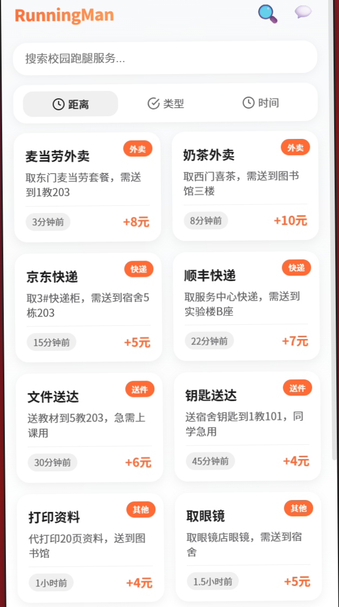
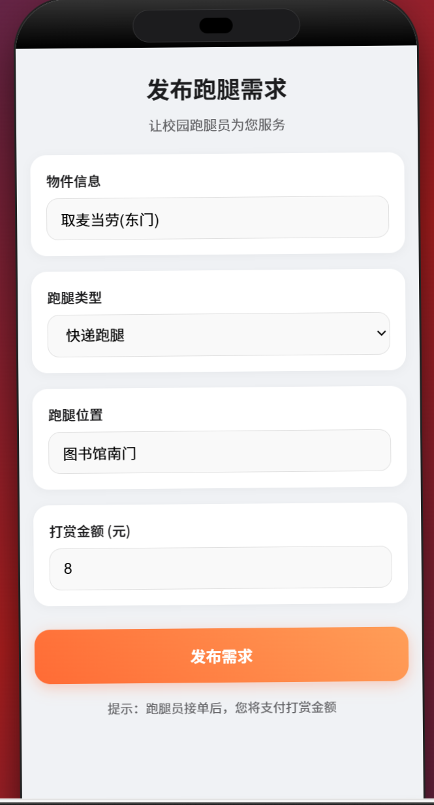
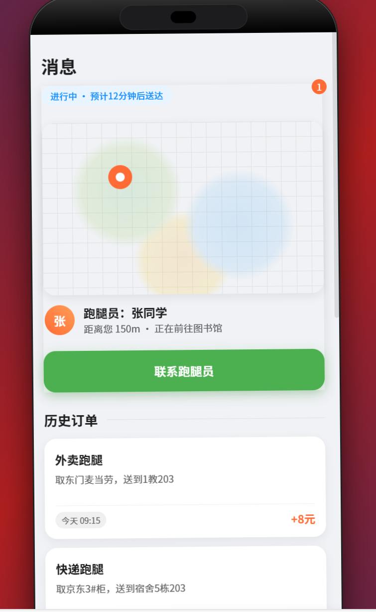
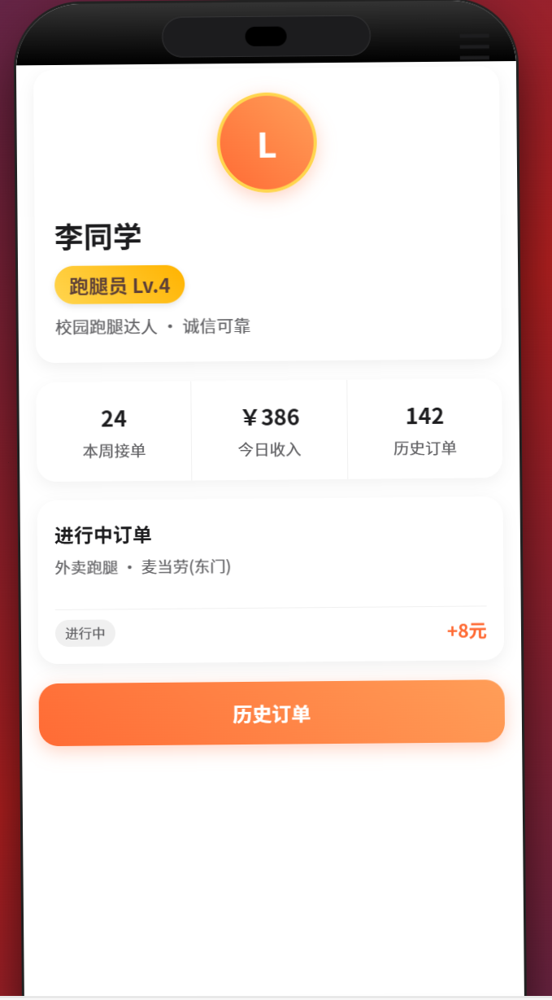

## 产品描述
经过小组讨论我们决定以Android应用软件的形式实现我们的校园跑腿系统，在项目管理上使用Github平台对我们的代码和资源文件进行管理，构建用于存储用户信息和任务信息的数据库。

## 产品功能
校园跑腿系统针对不同用户实现不同的功能。
任务发布者：登录、注册、填写个人信息、发布任务、查看任务完成情况、查看任务接取者基本信息、评价任务完成情况；
任务接取者者：登录、注册、填写个人信息、接取任务、查看任务内容、查看任务发布者基本信息；
管理员：查看后台数据，进行权限和数据管理

## 系统用例
系统中最重要的两个角色是任务发布者和任务接取者，他们的功能涵盖了整体功能的大部分，其用例图如下：

## 系统数据流图
系统运行数据流图如下

## 系统ER图
有上述描述可以得到系统的ER图如下

## 系统功能描述
基于Android软件开发，我们初步设计了六个页面，任务板界面、任务发布界面、任务完成情况界面、个人基本信息界面、登录界面、注册界面、修改密码界面。

### 用户登入
主要有大标题表明我们要登陆的的是一个校园跑腿平台的界面。其次要有登陆的基本信息：用户的用户名以及密码，以及需要一个登陆按键来支持页面的跳转，以及向后端发送post请求。其次还要有创见账号的按键提供用户进行选择，用户点击创建账号应该可以跳转到注册账号的信息，给用户提供注册功能。具体效果如图所示。

### 用户注册
主要有大标题表明这个界面是一个用户注册的界面。其次注册账号的基本信息：用户的用户名以及密码，以以及一个确定密码的操作，防止用户一次输入密码与自己想的密码不一致的尴尬，提供用户捡错密码的功能。以及需要一个注册按键来支持页面的跳转，以及向后端发送post提供给后端注册时的具体信息。请求具体模型如图所示。

### 密码维护
主要有大标题表明这个界面是一个忘记密码用于 修改账号 密码的界面。其次有修改密码提供的基本信息：用户的用户名以及密码，以以及一个确定密码的操作，防止用户一次输入密码与自己想的密码不一致的尴尬，提供用户捡错密码的功能。以及需要一个确认修改的按键来支持页面的跳转，以及向后端发送post提供给后端修改密码 时的具体信息。请求具体模型如图所示。

###	任务板
三个模块组成：第一个模块为最上方的搜索栏，提供给用户通过关键词检索任务；第二个模块为靠上的距离、类型、时间按钮，用户可根据这三个标准对任务进行进一步检索；第三个模块是占据大部分空间的任务板，它初始默认按任务发出时间进行排序，显示各种任务的大致信息，同时能够通过任务板跳转到对应任务进行接取。具体的模型如图所示。

### 任务发布
界面包含物件信息、跑腿类型、跑腿位置、打赏金额等必要信息，下方按钮为发布按钮，填写完毕后可对任务进行发布。具体的模型如图所示。

### 任务完成情况检测
界面最上方为物件配送信息能大致了解任务完成情况，往下是联系跑腿员的按钮，能提供跑腿员电话进行联系，再往下是历史订单，能对以前的订单进行查看。具体的模型如图所示。

### 个人基本信息
界面展示用户的基本信息，包含信用等级、本周接单数、总收入、历史完成总订单，下方还对当前正在进行的订单进行简单显示，最下方有一个按钮支持跳转到历史订单界面进行查看。具体的模型如图所示。
